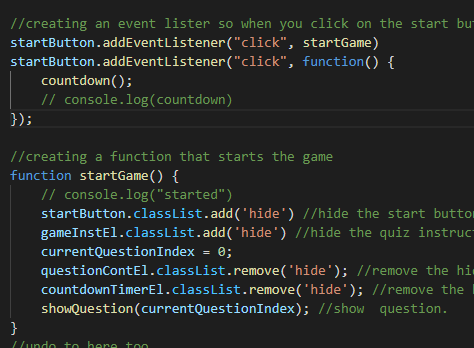
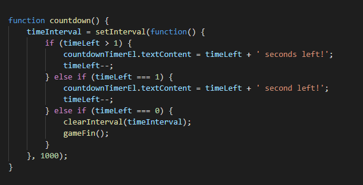
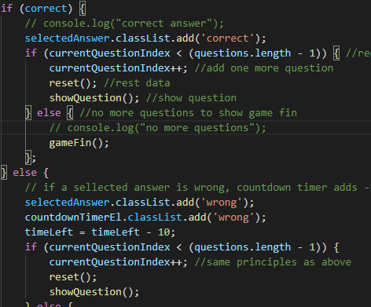
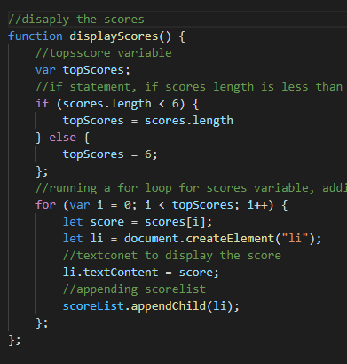
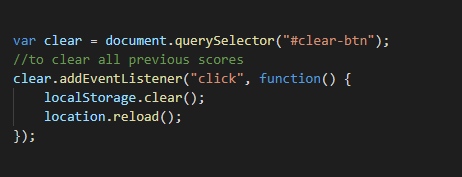

# <Create a time based quiz>

## Description
We were tasked to create a code based quiz that consisted of a time element, a time deduction element, a variety of questions that automatically change once a answer was selected, a sumbit form to log name and scores. 

This was an important task to undertake as it allowed me to further develop and implement my Javascript skills while also implementing my web api skills, i.e. how to use web apis to manipulate a webpage using Javascript. 

There were a number of problems that had to be solved to successfully complete this task. These ranged from creating a html structure that was logical, adding an event listerner with functions, creating functions. One of the harder issues to solve was in regard to implementing time intervals for the quiz and figuring out how to deduct time for an incorrect answer. Another difficult issue was how to allow the user to select an aswer (correct or wrong) and how to store their answer into local storage. A final issue ws figuring out how to disaply the scores on a new 'highscore' landing page. 

Similar to prevous tasks i learnt the important of having a plan / structure and working through the task at hand step by step. If you look at the task as a hole it appears to be overwhelming. However, if you break the task down into logical steps then it is much more acheiavble. 

I also learnt the important of researching ideas to help implement work and also that trial and error is a good method to figure out what works and what dosent. 

## Installation
There was no installation required for this topic. 

## Usage

To start the game; in my 'main.js' file i created an event listerner called 'startGame' as well as a function 'countdown'.When startGame (which was a button called Start Quiz) was clicked the game would start, and the countdown function would begin (which was the quiz timer. ) 

The function for start game consisted of a range of elements, which either made elements hide (start button, instruction) as well remove hidden elements so they would appear (questions and countdown would appear, and the first question would appear). startGame 

The countdown timer was set at 75 seconds, if and else if statmenets were designed so the user could see how much time they had left in the quiz, and when the timer ended, the game would finish (gameFin). countdown

Selecting the answer to questions was arguably the most difficult and complex part of the task. 
It was made up of a number of different elements. 
Firstly, if the answe was correct the the question would be removed and then it would add one more question, if there were no more questions left the game would finish. 
However, if a user selected the wrong answer then they would be deducted 10 seconds. 

Once moving to the highscore page, JSON.parse was used to retired the stored answers of the quiz. 

The answers were display using a display socre function, which set the number of scoresthat would be display. This was done by using an if/ else statmenet as well and a for loop. 

The final element that i created was a 'clear button'. Which would remove all stored scores and allow a user to start everything again for scratch. 

